# Someware AI

A full-stack SaaS that converts long PDFs into beautiful, concise summary reels using OpenAI and Gemini AI.

## ✨ Features

- PDF Upload with AWS s3
- Text Extraction using LangChain
- AI Summarization via Gemini
- Authentication and user management (Clerk)
- Subscription billing with Stripe (Basic & Pro Plans)
- Reels-style interactive summary viewer
- Admin dashboard and deletion logic
- Responsive UI with Tailwind CSS v4 + Framer Motion
- Deployed on Vercel using Next.js 15 server actions

## 🧱 Tech Stack

| Area         | Tech |
|--------------|------|
| Frontend     | Next.js 15, React 19, Tailwind, ShadCN UI |
| Backend      | Server Actions, Neon DB (PostgreSQL) |
| Auth         | Clerk |
| File Uploads | s3 |
| AI Services  | Gemini AI |
| Payments     | Stripe |
| Deployment   | Vercel |

## 🧠 Architecture Overview

```mermaid
graph TD
    %% === FRONTEND SECTION ===
    subgraph FRONTEND[🌐 Frontend]
        A[📄 User Uploads PDF]
        H[📊 Interactive Reel in Dashboard]
    end

    %% === BACKEND SECTION ===
    subgraph BACKEND[⚙️ Backend Services]
        B[☁️ AWS S3 - File Storage]
        C[🧠 LangChain - Extract Text]
        D[🤖 Gemini API - Summarize]
        G[🗄️ Neon DB - Save Summary]
    end

    %% === DATA FLOW ===
    A -- "PDF Upload" --> B
    B -- "Extracted Text" --> C
    C -- "Processed Text → Summary Request" --> D
    D -- "AI Summary" --> G
    G -- "Summary Data" --> H

    %% === STYLING ===
    style FRONTEND fill:#f0fdf4,stroke:#22c55e,stroke-width:2px,stroke-dasharray: 5 5
    style BACKEND fill:#f9fafb,stroke:#a3a3a3,stroke-width:2px,stroke-dasharray: 5 5

    style A fill:#fef6e4,stroke:#fbbf24,stroke-width:2px
    style B fill:#e0f2fe,stroke:#0284c7,stroke-width:2px
    style C fill:#e0f7f4,stroke:#14b8a6,stroke-width:2px
    style D fill:#e6f4ea,stroke:#22c55e,stroke-width:2px
    style G fill:#fef3c7,stroke:#f59e0b,stroke-width:2px
    style H fill:#ecfccb,stroke:#65a30d,stroke-width:2px
```

